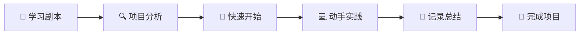

# 学习LangGraph 🤖

> 基于Google Gemini全栈LangGraph快速入门的深度学习实践

欢迎来到我的LangGraph学习之旅！本仓库记录了我学习和实践LangGraph构建智能研究助手的完整过程。

## 🎯 项目目标

通过对[Google Gemini全栈LangGraph快速入门](https://github.com/google-gemini/gemini-fullstack-langgraph-quickstart)项目的深度分析和重构，掌握：

- **LangGraph** 状态图和Agent架构设计
- **RAG（检索增强生成）** 系统实现
- **全栈开发** React + Python + LangGraph
- **AI Agent** 工作流设计和优化
- **生产级部署** Docker容器化和运维

## 📚 学习文档导航

### 🏗️ 核心文档
- **[📖 学习剧本](LANGGRAPH_LEARNING_PLAYBOOK.md)** - 完整的10天学习计划
- **[🔍 项目架构分析](PROJECT_ANALYSIS.md)** - 深度技术分析和代码解读
- **[🚀 快速开始指南](QUICK_START.md)** - 立即上手实践
- **[📝 学习进度记录](LEARNING_LOG.md)** - 个人学习日志模板

### 🛣️ 学习路径



## 🌟 原始项目特性

基于Google开源项目，本系统实现了：

- 🧠 **智能研究助手** - 基于LangGraph的Agent架构
- 🔍 **动态搜索策略** - 自动生成和优化搜索查询
- 🌐 **多源信息聚合** - 集成Google Search API
- 🤔 **反思性学习** - 识别知识缺口并迭代改进
- 📄 **引用生成** - 提供可验证的信息来源
- 💬 **全栈应用** - React前端 + FastAPI后端

## 🛠️ 技术栈

### 前端技术
- **React** + **TypeScript** - 现代前端框架
- **Vite** - 快速构建工具
- **Tailwind CSS** - 实用优先的CSS框架
- **Shadcn UI** - 高质量组件库

### 后端技术
- **LangGraph** - AI Agent框架
- **FastAPI** - 高性能Python Web框架
- **Google Gemini** - 先进的语言模型
- **Redis** + **PostgreSQL** - 数据存储和缓存

### 开发工具
- **Docker** - 容器化部署
- **LangSmith** - Agent调试和监控
- **Google Search API** - Web搜索集成

## 🚀 快速体验

想立即开始？跳转到 **[🚀 快速开始指南](QUICK_START.md)**

```bash
# 克隆原始项目
git clone https://github.com/google-gemini/gemini-fullstack-langgraph-quickstart.git

# 配置环境变量
echo 'GEMINI_API_KEY="your_api_key"' > backend/.env

# 启动项目
make dev
```

## 📈 学习进度跟踪

### 当前状态
- [x] 项目分析完成
- [x] 学习计划制定
- [x] 文档框架搭建
- [ ] 开始实践学习
- [ ] 功能扩展实验
- [ ] 项目部署测试

### 学习阶段
1. **🔧 环境搭建**（第1-2天）- 工具安装和基础理解
2. **📖 项目分析**（第3天）- 代码结构和工作流分析
3. **💻 后端实践**（第4-6天）- Agent开发和工具集成
4. **🎨 前端开发**（第7-8天）- React应用和界面优化
5. **🚀 部署优化**（第9-10天）- 容器化和性能调优

## 💡 学习亮点

### 核心概念掌握
- **状态图设计** - 理解Agent决策过程
- **提示词工程** - 优化AI模型输出质量
- **工具集成** - 扩展Agent外部能力
- **流式响应** - 实现实时用户交互

### 实践技能
- **调试技巧** - 使用LangSmith追踪执行过程
- **性能优化** - 缓存策略和并发处理
- **错误处理** - 构建健壮的AI应用
- **部署运维** - Docker容器化和生产配置

## 🤝 学习社区

### 获取帮助
- **GitHub Issues** - 在本仓库提问
- **LangGraph Discord** - 官方社区讨论
- **原项目讨论** - 参与开源项目交流

### 贡献方式
- 📝 分享学习心得和改进建议
- 🐛 报告问题和解决方案
- 🔧 提交代码改进和功能扩展
- 📚 完善文档和教程

## 📊 项目统计

- **学习周期**：10天密集学习
- **代码文件**：20+核心文件分析
- **实践练习**：15+动手实验
- **技术栈**：8+主要技术
- **文档页面**：4个完整指南

## 🔗 相关资源

### 官方文档
- [LangGraph文档](https://langchain-ai.github.io/langgraph/)
- [Google Gemini API](https://ai.google.dev/docs)
- [原始项目仓库](https://github.com/google-gemini/gemini-fullstack-langgraph-quickstart)

### 学习资源
- [LangChain官方教程](https://python.langchain.com/docs/get_started/)
- [React + TypeScript指南](https://react-typescript-cheatsheet.netlify.app/)
- [FastAPI快速入门](https://fastapi.tiangolo.com/tutorial/)

---

## 📞 联系方式

有问题或想交流学习心得？

- **GitHub Issues**：在本仓库创建Issue
- **Discussions**：使用GitHub Discussions

---

<div align="center">

**🎯 目标明确，步步为营，让我们一起掌握LangGraph！**

[](LANGGRAPH_LEARNING_PLAYBOOK.md)
[](QUICK_START.md)

</div>
