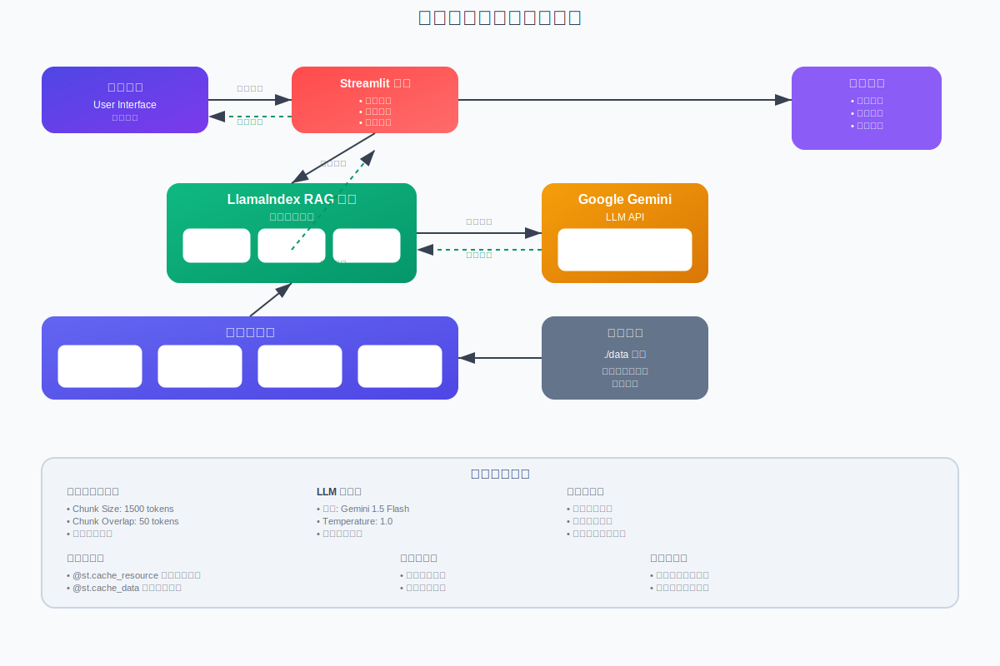

# 泰戈尔作品问答系统 🦙

基于 LlamaIndex 和 Google Gemini 构建的智能文学问答聊天机器人，专门用于回答关于拉宾德拉纳特·泰戈尔作品的问题。

## 📋 目录

- [系统架构](#系统架构)
- [功能特性](#功能特性)
- [技术栈](#技术栈)
- [安装部署](#安装部署)
- [使用说明](#使用说明)

## 🏗️ 系统架构

本系统采用 RAG（检索增强生成）架构，结合文档检索和生成式AI技术：

### 📊 架构图

> 📱 **在线查看**：[交互式架构图](https://lw9726.github.io/note1/architecture-diagram.html)  
> 📄 **SVG文件**：[下载架构图](https://lw9726.github.io/note1/architecture-diagram.svg)

<!-- 直接在README中嵌入SVG -->


<details>
<summary>🔍 点击查看架构详细说明</summary>

### 核心组件

- **用户界面层**：Streamlit 提供的交互式Web界面
- **RAG引擎**：LlamaIndex 实现的检索增强生成
- **数据处理层**：文档读取、分块、向量化处理
- **AI服务**：Google Gemini 1.5 Flash 模型
- **存储层**：本地文档存储和向量索引

### 数据流程

1. 用户输入关于泰戈尔作品的问题
2. 系统将问题向量化并检索相关文档片段
3. 将检索结果与问题组合成增强提示
4. Gemini 模型生成专业回答
5. 流式返回结果给用户

</details>

---

## ✨ 功能特性

- 🎯 **专业问答**：针对泰戈尔作品的专家级问答
- 🔍 **智能检索**：基于向量相似度的精准文档检索  
- 💬 **对话记忆**：维护上下文相关的多轮对话
- 🎨 **文学风格**：采用早期现代主义文学风格回答
- 🛡️ **安全过滤**：内置内容安全检查机制
- ⚡ **流式响应**：实时显示生成内容
- 📱 **响应式UI**：适配各种设备的用户界面

## 🛠️ 技术栈

| 组件 | 技术 | 版本 |
|------|------|------|
| **前端框架** | Streamlit | Latest |
| **RAG框架** | LlamaIndex | Latest |
| **LLM模型** | Google Gemini | 1.5 Flash |
| **向量化** | GeminiEmbedding | Latest |
| **文本处理** | NLTK | Latest |

## 🚀 安装部署

### 环境要求

- Python 3.8+
- Google Gemini API Key

### 快速开始

1. **克隆仓库**
   ```bash
   git clone https://github.com/your-username/your-repo-name.git
   cd your-repo-name
   ```

2. **安装依赖**
   ```bash
   pip install -r requirements.txt
   ```

3. **配置API密钥**
   ```bash
   # 创建 .streamlit/secrets.toml 文件
   mkdir .streamlit
   echo 'google_gemini_key = "your-api-key-here"' > .streamlit/secrets.toml
   ```

4. **准备数据**
   ```bash
   # 将泰戈尔作品文档放入 data 目录
   mkdir data
   # 添加您的文档文件...
   ```

5. **启动应用**
   ```bash
   streamlit run streamlit_app.py
   ```

## 📖 使用说明

1. 打开浏览器访问 `http://localhost:8501`
2. 在聊天框中输入关于泰戈尔作品的问题
3. 系统会基于文档库提供专业回答
4. 支持多轮对话，保持上下文连贯

### 示例问题

- "泰戈尔在《吉檀迦利》中表达了什么主题？"
- "请解释泰戈尔诗歌中的神秘主义元素"
- "《戈拉》这部小说的主要冲突是什么？"

## 📁 项目结构

```
├── streamlit_app.py           # 主应用文件
├── architecture-diagram.svg   # 系统架构图（SVG格式）
├── architecture-diagram.html  # 交互式架构图展示页面
├── data/                      # 文档数据目录
│   └── tagore-works/         # 泰戈尔作品文档
├── .streamlit/
│   └── secrets.toml          # API密钥配置
├── requirements.txt          # 依赖包列表
└── README.md                 # 项目说明文档
```

## 🔧 配置说明

### 系统参数

- **Chunk Size**: 1500 tokens - 文档分块大小
- **Chunk Overlap**: 50 tokens - 分块重叠长度
- **Temperature**: 1.0 - 生成随机性控制
- **Response Limit**: 100 words - 回答长度限制

### 安全设置

系统配置了多层安全机制：
- 内容安全过滤
- 有害内容拦截
- 错误重试机制
- 用户友好错误提示

## 🌟 在线演示

- 📱 **架构图展示**: [交互式查看](https://lw9726.github.io/note1/architecture-diagram.html)
- 📊 **系统监控**: [性能仪表板](#) *(开发中)*
- 🎯 **在线体验**: [立即试用](#) *(部署后可用)*

## 🤝 贡献指南

欢迎提交 Issue 和 Pull Request！

1. Fork 本仓库
2. 创建特性分支 (`git checkout -b feature/AmazingFeature`)
3. 提交更改 (`git commit -m 'Add some AmazingFeature'`)
4. 推送到分支 (`git push origin feature/AmazingFeature`)
5. 打开 Pull Request

## 📄 许可证

本项目采用 MIT 许可证 - 查看 [LICENSE](LICENSE) 文件了解详情

## 🙏 致谢

- [LlamaIndex](https://www.llamaindex.ai/) - 强大的RAG框架
- [Google Gemini](https://ai.google.dev/) - 优秀的语言模型
- [Streamlit](https://streamlit.io/) - 快速Web应用开发
- 拉宾德拉纳特·泰戈尔 - 伟大的文学作品

---

<div align="center">

**[⬆ 返回顶部](#泰戈尔作品问答系统-)**

Made with ❤️ for literature lovers


</div>
